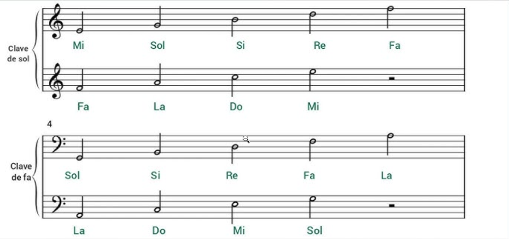
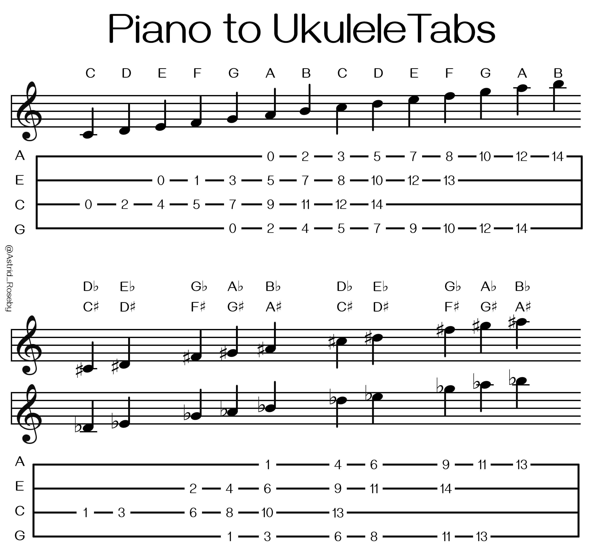
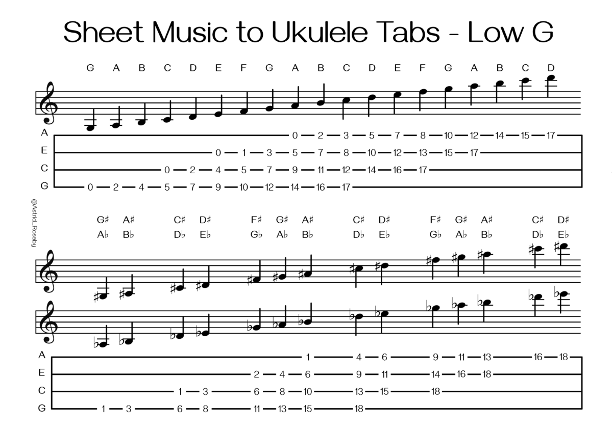
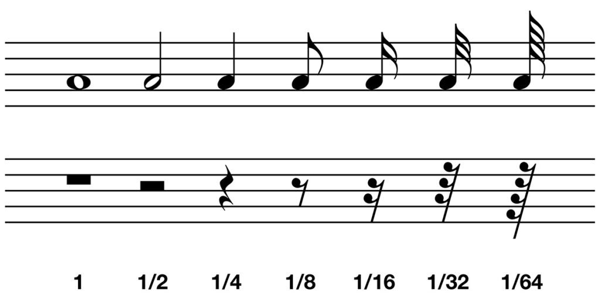

[<- Volver al índice principal](../README.md)

---

## Contenido

### Fundamentos Básicos
- [Cifrado Americano](#cifrado-americano)
- [Grados de la Escala](#grados-de-la-escala)
- [Escala Cromática](#escala-cromática)

### Tablaturas
- [¿Qué es una Tablatura?](#qué-es-una-tablatura)
- [Estructura de Tablaturas](#estructura-de-tablaturas)
- [Ejemplos de Lectura de Tablaturas](#ejemplos-de-lectura-de-tablaturas)
- [Técnicas Avanzadas en Tablaturas](#técnicas-avanzadas-en-tablaturas)
- [Ventajas y Limitaciones de Tablaturas](#ventajas-y-limitaciones-de-tablaturas)

### Partituras
- [¿Qué es una Partitura?](#qué-es-una-partitura)
- [El Pentagrama](#el-pentagrama)
- [Claves Musicales](#claves-musicales)
- [Correspondencia: Partitura ↔ Ukelele](#correspondencia-partitura--ukelele)
- [Duración de las Notas](#duración-de-las-notas)
- [Silencios Musicales](#silencios-musicales)
- [Visualización de Notas y Tiempos](#visualización-de-notas-y-tiempos)
- [Símbolos Adicionales](#símbolos-adicionales)

---

# FUNDAMENTOS BÁSICOS

## Cifrado Americano

El **cifrado americano** es una forma de nombrar las notas musicales usando letras:

| Nota | Do | Re | Mi | Fa | Sol | La | Si |
| --- | --- | --- | --- | --- | --- | --- | --- |
| Letra | C | D | E | F | G | A | B |

---

## Grados de la Escala

**Grados de la escala mayor (en C):**

| Grado | I | II | III | IV | V | VI | VII |
| --- | --- | --- | --- | --- | --- | --- | --- |
| Nota | C | D | E | F | G | A | B |

---

## Escala Cromática

**Todas las notas musicales (incluyendo sostenidos y bemoles):**
```
C - C#/Db - D - D#/Eb - E - F - F#/Gb - G - G#/Ab - A - A#/Bb - B - C
```

---

# TABLATURAS

## ¿Qué es una Tablatura?

Una **tablatura** (o "tab") es una forma de notación musical que muestra dónde colocar los dedos en el instrumento. Es especialmente útil para instrumentos de cuerda como el ukelele, ya que indica exactamente qué cuerda tocar y en qué traste.

**Importante**: Existen dos sistemas principales de notación de tablaturas. En este documento usaremos principalmente el **Sistema 1** (con números de trastes abajo), que es más claro para principiantes.

---

## Estructura de Tablaturas

### **Sistema 1: Con números de trastes (recomendado para principiantes)**
```
A|---|---|---|---|--- <- Cuerda A (la más aguda)
E|---|---|---|---|--- <- Cuerda E
C|---|---|---|---|--- <- Cuerda C
G|---|-x-|---|---|--- <- Cuerda G (tocar)
-0---1---2---3---4--- <- Números de trastes
```

**Explicación:**
- **Líneas horizontales**: Representan las 4 cuerdas del ukelele
- **X**: Significa "tocar esta cuerda"
- **Números abajo**: Indican en qué traste presionar la cuerda marcada con X
- **0**: Significa traste numero 0 o "cuerda al aire" (sin presionar)

### **Sistema 2: Sin números de trastes (sistema tradicional)**
```
A|---|---|--- <- Cuerda A (la más aguda)
E|---|---|--- <- Cuerda E
C|---|---|--- <- Cuerda C
G|---|-3-|--- <- Cuerda G en traste 3
```

**Explicación:**
- **Líneas horizontales**: Representan las 4 cuerdas del ukelele
- **Números en las líneas**: Indican directamente el traste donde presionar
- **Sin numero**: Significa "cuerda al aire" (sin presionar)

---

## Ejemplos de Lectura de Tablaturas

### **Nota Individual (Sistema 1)**
```
A|---|---|---|---|---
E|---|---|---|---|---
C|---|---|---|---|---
G|---|-x-|---|---|---
-0---1---2---3---4---
```
**Resultado**: Toca la cuerda G en el traste 3

### **Nota Individual (Sistema 2)**
```
A|---|---|---
E|---|-4-|---
C|---|---|---
G|---|---|---
```
**Resultado**: Toca la cuerda E en el traste 4

### **Acorde Completo (Sistema 1)**
```
A|---|---|-x-|---|---
E|---|---|---|---|---
C|---|---|---|---|---
G|---|---|---|---|---
-0---1---2---3---4---
```
**Resultado**: Acorde C mayor (C - E - G) - tocar todas las cuerdas en los trastes indicados

### **Acorde Completo (Sistema 2)**
```
A|---|-3-|---
E|---|-0-|---
C|---|-0-|---
G|---|-0-|---
```
**Resultado**: Acorde C mayor (C - E - G) - cada número indica el traste de cada cuerda

---

## Técnicas Avanzadas en Tablaturas

### **Hammer-on (h)**
```
A|---|-2h4-|---
```
- Toca la nota en el traste 2
- Sin levantar el dedo, golpea el traste 4
- Crea un efecto de "martilleo" ascendente

### **Pull-off (p)**
```
A|---|-4p2-|---
```
- Toca la nota en el traste 4
- Sin levantar el dedo, tira hacia abajo para sonar el traste 2
- Crea un efecto de "tirón" descendente

### **Slide (/)**
```
A|---|-2/4-|---
```
- Toca la nota en el traste 2
- Sin levantar el dedo, desliza hacia el traste 4
- Crea un efecto de "deslizamiento" ascendente

### **Bend (b)**
```
A|---|-2b-|---
```
- Toca la nota en el traste 2
- Sin levantar el dedo, dobla la cuerda hacia arriba
- Crea un efecto de "flexión" que sube el tono

---

## Ventajas y Limitaciones de Tablaturas

### **✅ Ventajas:**
- **Fácil de aprender** para principiantes
- **Indica exactamente** dónde colocar los dedos
- **No requiere** conocimientos de teoría musical
- **Visualmente claro** para instrumentos de cuerda
- **Ideal para canciones** específicas del instrumento

### **❌ Limitaciones:**
- **No indica ritmo** (a menos que se especifique)
- **No muestra la duración** de las notas
- **Limitado a un instrumento** específico
- **No incluye dinámicas** (forte, piano, etc.)
- **Puede ser confuso** con técnicas avanzadas

---

# PARTITURAS

## ¿Qué es una Partitura?

Una **partitura** es la notación musical estándar que representa la música de forma universal. A diferencia de las tablaturas, las partituras muestran:
- **Altura de las notas** (qué nota tocar)
- **Duración de las notas** (cuánto tiempo sostener)
- **Ritmo y tempo** (cómo y a qué velocidad tocar)
- **Dinámica** (fuerte, suave, crescendo, etc.)

---

## El Pentagrama

```
───────────── <- Línea 5 (superior)
───────────── <- Línea 4
───────────── <- Línea 3 (central)
───────────── <- Línea 2
───────────── <- Línea 1 (inferior)
```

---

## Claves Musicales



### **Clave de Sol (G)**
```
───────────── <- F (Fa)
───────────── <- D (Re)
───────────── <- B (Si)
───────────── <- G (Sol) <- Clave de Sol
───────────── <- E (Mi)
```
**La clave de Sol indica que la nota G (Sol) está en la línea 2**

### **Clave de Fa (F)**
```
───────────── <- A (La)
───────────── <- F (Fa) <- Clave de Fa
───────────── <- D (Re)
───────────── <- B (Si)
───────────── <- G (Sol)
```
**La clave de Fa indica que la nota F (Fa) está en la línea 4**

---

## Correspondencia: Partitura ↔ Ukelele

### **Afinación High G (GCEA) - Estándar**
Esta tabla muestra la conversión para ukelele con afinación estándar High G:



### **Afinación Low G (GCEA) - Alternativa**
Esta tabla muestra la conversión para ukelele con afinación Low G:



**Explicación de las tablas:**
- **Notas naturales** (C, D, E, F, G, A, B): Posiciones en trastes específicos
- **Notas alteradas** (C#/Db, D#/Eb, F#/Gb, G#/Ab, A#/Bb): Posiciones con sostenidos y bemoles
- **Números**: Indican el traste donde presionar cada cuerda

**¿Cuál usar?**

La principal diferencia entre ukelele de afinación high-G y low-G radica en la nota de la cuarta cuerda, la más grave. En la afinación estándar (high-G), la cuarta cuerda es un sol agudo (G4), mientras que en la afinación low-G, esa misma cuerda se afina una octava más grave (G3), creando un sonido más profundo y amplio.
- **High G**: Afinación estándar, más común en ukeleles
- **Low G**: Afinación alternativa, proporciona más rango grave

---

## Duración de las Notas

| Nota | Descripción del Símbolo | Duración | Valor |
|------|-------------------------|----------|-------|
| **Redonda** | Círculo blanco sin palo | 4 tiempos | 1 |
| **Blanca** | Círculo blanco con palo | 2 tiempos | 1/2 |
| **Negra** | Círculo negro relleno con palo | 1 tiempo | 1/4 |
| **Corchea** | Círculo negro con palo y una bandera | 1/2 tiempo | 1/8 |
| **Semicorchea** | Círculo negro con palo y dos banderas | 1/4 tiempo | 1/16 |

---

## Silencios Musicales

| Silencio | Descripción del Símbolo | Duración | Valor |
|----------|-------------------------|----------|-------|
| **Silencio de Redonda** | Rectángulo negro colgando de la 4ª línea | 4 tiempos | 1 |
| **Silencio de Blanca** | Rectángulo negro sentado en la 3ª línea | 2 tiempos | 1/2 |
| **Silencio de Negra** | Símbolo similar a una "Z" estilizada | 1 tiempo | 1/4 |
| **Silencio de Corchea** | Línea diagonal con una bandera | 1/2 tiempo | 1/8 |
| **Silencio de Semicorchea** | Línea diagonal con dos banderas | 1/4 tiempo | 1/16 |

---

## Visualización de Notas y Tiempos

Esta imagen muestra claramente cómo se ven las diferentes notas y sus duraciones:



**Explicación de la imagen:**
- **Pentagrama superior**: Muestra las notas musicales con sus símbolos visuales
- **Pentagrama inferior**: Muestra los silencios correspondientes a cada nota
- **Fracciones**: Indican la duración relativa de cada nota (1, 1/2, 1/4, 1/8, 1/16, 1/32, 1/64)
- **Progresión**: Desde la redonda (1 tiempo completo) hasta la sesentaicuatra (1/64 de tiempo)
- **Relación**: Cada nota tiene su silencio correspondiente con la misma duración

---

## Símbolos Adicionales

### **Alteraciones**
- **Sostenido (#)**: Sube la nota medio tono
- **Bemol (♭)**: Baja la nota medio tono
- **Becuadro (♮)**: Cancela la alteración anterior

### **Signos de Repetición**
- **Barra de repetición**: ║: :║
- **Da Capo (D.C.)**: Volver al inicio
- **Dal Segno (D.S.)**: Volver al signo

### **Dinámica**
- **p**: Piano (suave)
- **f**: Forte (fuerte)
- **mp**: Mezzo-piano (medio suave)
- **mf**: Mezzo-forte (medio fuerte)
- **cresc.**: Crescendo (aumentar volumen)
- **dim.**: Diminuendo (disminuir volumen)

---

## Navegación

- **🏠 Inicio**: [Teoría Musical para Ukelele](../README.md)
- **📚 Teoría**:
    - 🎼 [Escalas y Progresiones](./escalas.md)
    - 🎸 [Construcción de Acordes](./acordes.md)
- **🎵 Canciones**: [Repertorio Completo](../canciones/README.md)

---

*Esta sección cubre los fundamentos de la notación musical, incluyendo tablaturas y partituras. Continúa con escalas y progresiones o construcción de acordes.*
