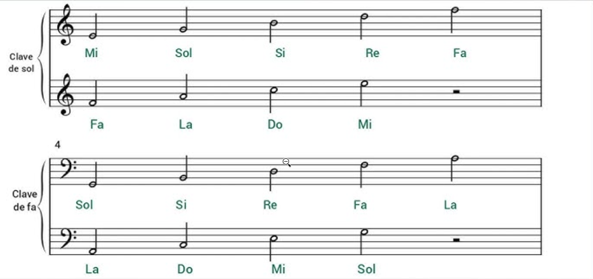

# Lectura de Partituras

[← Volver al índice principal](../README.md) | [← Módulo anterior: Tablaturas](./tablaturas.md)

---

## Contenido del Módulo

- [¿Qué es una Partitura?](#qué-es-una-partitura)
- [El Pentagrama](#el-pentagrama-líneas-del-pentagrama)
- [Claves Musicales](#claves-musicales)
- [Correspondencia: Partitura ↔ Ukelele](#correspondencia-partitura--ukelele)
- [Duración de las Notas](#duración-de-las-notas)
- [Silencios Musicales](#silencios-musicales)
- [Visualización de Notas y Tiempos](#visualización-de-notas-y-tiempos)
- [Símbolos Adicionales](#símbolos-adicionales)

---

## ¿Qué es una Partitura?

Una **partitura** es la notación musical estándar que representa la música de forma universal. A diferencia de las tablaturas, las partituras muestran:
- **Altura de las notas** (qué nota tocar)
- **Duración de las notas** (cuánto tiempo sostener)
- **Ritmo y tempo** (cómo y a qué velocidad tocar)
- **Dinámica** (fuerte, suave, crescendo, etc.)

---

## El Pentagrama (Líneas del Pentagrama)

```
─────────────  ← Línea 5 (superior)
─────────────  ← Línea 4
─────────────  ← Línea 3 (central)
─────────────  ← Línea 2
─────────────  ← Línea 1 (inferior)
```

---

## Claves Musicales



### **Clave de Sol (G)**
```
─────────────  ← F (Fa)
─────────────  ← D (Re)
─────────────  ← B (Si)
─────────────  ← G (Sol) ← Clave de Sol
─────────────  ← E (Mi)
```
**La clave de Sol indica que la nota G (Sol) está en la línea 2**

### **Clave de Fa (F)**
```
─────────────  ← A (La)
─────────────  ← F (Fa) ← Clave de Fa
─────────────  ← D (Re)
─────────────  ← B (Si)
─────────────  ← G (Sol)
```
**La clave de Fa indica que la nota F (Fa) está en la línea 4**

---

## Correspondencia: Partitura ↔ Ukelele

### **Afinación High G (GCEA) - Estándar**
Esta tabla muestra la conversión para ukelele con afinación estándar High G:


### **Afinación Low G (GCEA) - Alternativa**
Esta tabla muestra la conversión para ukelele con afinación Low G:


**Explicación de las tablas:**
- **Notas naturales** (C, D, E, F, G, A, B): Posiciones en trastes específicos
- **Notas alteradas** (C#/Db, D#/Eb, F#/Gb, G#/Ab, A#/Bb): Posiciones con sostenidos y bemoles
- **Números**: Indican el traste donde presionar cada cuerda

**¿Cuál usar?**
- **High G**: Afinación estándar, más común en ukeleles
- **Low G**: Afinación alternativa, proporciona más rango grave

---

## Duración de las Notas

| Nota | Descripción del Símbolo | Duración | Valor |
|------|-------------------------|----------|-------|
| **Redonda** | Círculo blanco sin palo | 4 tiempos | 1 |
| **Blanca** | Círculo blanco con palo | 2 tiempos | 1/2 |
| **Negra** | Círculo negro relleno con palo | 1 tiempo | 1/4 |
| **Corchea** | Círculo negro con palo y una bandera | 1/2 tiempo | 1/8 |
| **Semicorchea** | Círculo negro con palo y dos banderas | 1/4 tiempo | 1/16 |

---

## Silencios Musicales

| Silencio | Descripción del Símbolo | Duración | Valor |
|----------|-------------------------|----------|-------|
| **Silencio de Redonda** | Rectángulo negro colgando de la 4ª línea | 4 tiempos | 1 |
| **Silencio de Blanca** | Rectángulo negro sentado en la 3ª línea | 2 tiempos | 1/2 |
| **Silencio de Negra** | Símbolo similar a una "Z" estilizada | 1 tiempo | 1/4 |
| **Silencio de Corchea** | Línea diagonal con una bandera | 1/2 tiempo | 1/8 |
| **Silencio de Semicorchea** | Línea diagonal con dos banderas | 1/4 tiempo | 1/16 |

---

## Visualización de Notas y Tiempos

Esta imagen muestra claramente cómo se ven las diferentes notas y sus duraciones:


**Explicación de la imagen:**
- **Pentagrama superior**: Muestra las notas musicales con sus símbolos visuales
- **Pentagrama inferior**: Muestra los silencios correspondientes a cada nota
- **Fracciones**: Indican la duración relativa de cada nota (1, 1/2, 1/4, 1/8, 1/16, 1/32, 1/64)
- **Progresión**: Desde la redonda (1 tiempo completo) hasta la sesentaicuarta (1/64 de tiempo)
- **Relación**: Cada nota tiene su silencio correspondiente con la misma duración

---

## Símbolos Adicionales

### **Alteraciones**
- **Sostenido (#)**: Sube la nota medio tono
- **Bemol (♭)**: Baja la nota medio tono
- **Becuadro (♮)**: Cancela la alteración anterior

### **Signos de Repetición**
- **Barra de repetición**: ║: :║
- **Da Capo (D.C.)**: Volver al inicio
- **Dal Segno (D.S.)**: Volver al signo

### **Dinámica**
- **p**: Piano (suave)
- **f**: Forte (fuerte)
- **mp**: Mezzo-piano (medio suave)
- **mf**: Mezzo-forte (medio fuerte)
- **cresc.**: Crescendo (aumentar volumen)
- **dim.**: Diminuendo (disminuir volumen)

---

## Navegación

- **🏠 Inicio**: [Teoría Musical para Ukelele](../README.md)
- **📚 Módulo anterior**: [Lectura de Tablaturas](./tablaturas.md)
- **📚 Siguiente módulo**: [Escala Mayor](./escalas.md)
- **🎵 Canciones**: [Repertorio Completo](../canciones/)

---

*Este módulo cubre la lectura de partituras musicales estándar. Continúa con el siguiente módulo para aprender sobre escalas.*