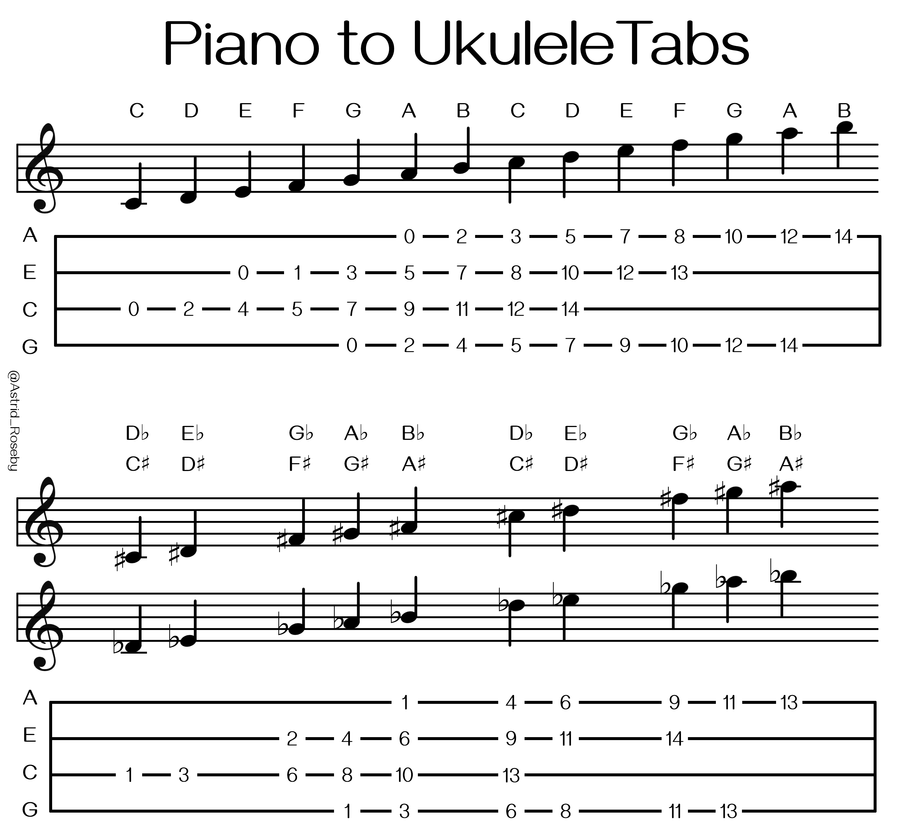
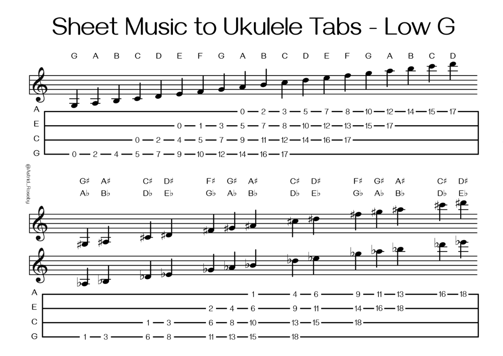

# 📒 Resumen de Teoría Musical - Ukelele

[← Volver al índice principal](../README.md) | [🎵 Ir a Canciones](./canciones/README.md)

---

## 📋 **Índice**

### 🎵 **Fundamentos**
- [1. Fundamentos de la Notación Musical](#1-fundamentos-de-la-notación-musical)
- [2. Lectura de Tablaturas](#2-lectura-de-tablaturas)
- [3. Lectura de Partituras](#3-lectura-de-partituras)
- [4. Escala Mayor](#4-escala-mayor)
- [5. Diagramas de Escala Mayor](#5-diagramas-de-escala-mayor-ukelele)
- [6. Construcción de Acordes](#6-construcción-de-acordes)

### 🎼 **Acordes Diatónicos**
- [C Mayor](#c-mayor)
- [G Mayor](#g-mayor)
- [D Mayor](#d-mayor)
- [A Mayor](#a-mayor)
- [E Mayor](#e-mayor)
- [B Mayor](#b-mayor)
- [F Mayor](#f-mayor)

### 🎸 **Aplicación Práctica**
- [Progresiones de Acordes Comunes](#progresiones-de-acordes-comunes)
- [Consejos para Practicar](#consejos-para-practicar)

---

---

## 1. Fundamentos de la Notación Musical

### Cifrado Americano
El **cifrado americano** es una forma de nombrar las notas musicales usando letras:

| Nota | Do | Re | Mi | Fa | Sol | La | Si |
| --- | --- | --- | --- | --- | --- | --- | --- |
| Letra | C | D | E | F | G | A | B |

### Grados de la Escala
**Grados de la escala mayor (en C):**

| Grado | I | II | III | IV | V | VI | VII |
| --- | --- | --- | --- | --- | --- | --- | --- |
| Nota | C | D | E | F | G | A | B |

### Escala Cromática
**Todas las notas musicales (incluyendo sostenidos y bemoles):**
```
C - C#/Db - D - D#/Eb - E - F - F#/Gb - G - G#/Ab - A - A#/Bb - B - C
```

---

## 2. Lectura de Tablaturas

### ¿Qué es una Tablatura?
Una **tablatura** (o "tab") es una forma de notación musical que muestra dónde colocar los dedos en el instrumento. Es especialmente útil para instrumentos de cuerda como el ukelele, ya que indica exactamente qué cuerda tocar y en qué traste.

**Importante**: Existen dos sistemas principales de notación de tablaturas. En este documento usaremos principalmente el **Sistema 1** (con números de trastes abajo), que es más claro para principiantes.

### Estructura de una Tablatura de Ukelele

#### **Sistema 1: Con números de trastes (recomendado para principiantes)**
```
A|---|---|---|---|---  ← Cuerda A (la más aguda)
E|---|---|---|---|---  ← Cuerda E
C|---|---|---|---|---  ← Cuerda C
G|---|-x-|---|---|---  ← Cuerda G (tocar)
-0---1---2---3---4---  ← Números de trastes
```

**Explicación:**
- **Líneas horizontales**: Representan las 4 cuerdas del ukelele
- **X**: Significa "tocar esta cuerda"
- **Números abajo**: Indican en qué traste presionar la cuerda marcada con X
- **0**: Significa traste numero 0 o "cuerda al aire" (sin presionar)

#### **Sistema 2: Sin números de trastes (sistema tradicional)**
```
A|---|---|---  ← Cuerda A (la más aguda)
E|---|---|---  ← Cuerda E
C|---|---|---  ← Cuerda C
G|---|-3-|---  ← Cuerda G en traste 3
```

**Explicación:**
- **Líneas horizontales**: Representan las 4 cuerdas del ukelele
- **Números en las líneas**: Indican directamente el traste donde presionar
- **Sin numero**: Significa "cuerda al aire" (sin presionar)

### Ejemplos de Lectura

#### **Nota Individual (Sistema 1)**
```
A|---|---|---|---|---
E|---|---|---|---|---
C|---|---|---|---|---
G|---|-x-|---|---|---
-0---1---2---3---4---
```
**Resultado**: Toca la cuerda G en el traste 3

#### **Nota Individual (Sistema 2)**
```
A|---|---|---
E|---|-4-|---
C|---|---|---
G|---|---|---
```
**Resultado**: Toca la cuerda E en el traste 4

#### **Acorde Completo (Sistema 1)**
```
A|---|---|-x-|---|---
E|---|---|---|---|---
C|---|---|---|---|---
G|---|---|---|---|---
-0---1---2---3---4---
```
**Resultado**: Acorde C mayor (C - E - G) - tocar todas las cuerdas en los trastes indicados

#### **Acorde Completo (Sistema 2)**
```
A|---|-3-|---
E|---|-0-|---
C|---|-0-|---
G|---|-0-|---
```
**Resultado**: Acorde C mayor (C - E - G) - cada número indica el traste de cada cuerda

### Técnicas Avanzadas

#### **Hammer-on (h)**
```
A|---|-2h4-|---
```
- Toca la nota en el traste 2
- Sin levantar el dedo, golpea el traste 4
- Crea un efecto de "martilleo" ascendente

#### **Pull-off (p)**
```
A|---|-4p2-|---
```
- Toca la nota en el traste 4
- Sin levantar el dedo, tira hacia abajo para sonar el traste 2
- Crea un efecto de "tirón" descendente

#### **Slide (/)**
```
A|---|-2/4-|---
```
- Toca la nota en el traste 2
- Desliza el dedo hacia el traste 4
- Mantén presionado durante el deslizamiento

### Consejos para Leer Tablaturas

1. **Lee de izquierda a derecha** como un texto normal
2. **Identifica el tempo** - las tablaturas no muestran ritmo
3. **Practica lentamente** al principio
4. **Usa un metrónomo** para mantener el tiempo
5. **Escucha la canción original** para entender el ritmo
6. **Comienza con canciones simples** antes de avanzar

### Ventajas de las Tablaturas

✅ **Fácil de aprender** para principiantes
✅ **Muestra exactamente dónde colocar los dedos**
✅ **No requiere conocimientos de solfeo**
✅ **Ideal para instrumentos de cuerda**
✅ **Permite aprender canciones rápidamente**

### Limitaciones de las Tablaturas

❌ **No muestran el ritmo** (solo la melodía)
❌ **No indican la duración de las notas**
❌ **Pueden ser imprecisas** dependiendo de la fuente
❌ **No enseñan teoría musical**

---

## 3. Lectura de Partituras

### ¿Qué es una Partitura?
Una **partitura** es la notación musical estándar que representa la música de forma universal. A diferencia de las tablaturas, las partituras muestran:
- **Altura de las notas** (qué nota tocar)
- **Duración de las notas** (cuánto tiempo sostener)
- **Ritmo y tempo** (cómo y a qué velocidad tocar)
- **Dinámica** (fuerte, suave, crescendo, etc.)


### El Pentagrama (Líneas del Pentagrama)
```
─────────────  ← Línea 5 (superior)
─────────────  ← Línea 4
─────────────  ← Línea 3 (central)
─────────────  ← Línea 2
─────────────  ← Línea 1 (inferior)
```

### Claves Musicales

#### **Clave de Sol (G)**
```
─────────────  ← F (Fa)
─────────────  ← D (Re)
─────────────  ← B (Si)
─────────────  ← G (Sol) ← Clave de Sol
─────────────  ← E (Mi)
```
**La clave de Sol indica que la nota G (Sol) está en la línea 2**

#### **Clave de Fa (F)**
```
─────────────  ← A (La)
─────────────  ← F (Fa) ← Clave de Fa
─────────────  ← D (Re)
─────────────  ← B (Si)
─────────────  ← G (Sol)
```
**La clave de Fa indica que la nota F (Fa) está en la línea 4**

### Correspondencia: Partitura ↔ Ukelele

#### **Afinación High G (GCEA) - Estándar**
Esta tabla muestra la conversión para ukelele con afinación estándar High G:



#### **Afinación Low G (GCEA) - Alternativa**
Esta tabla muestra la conversión para ukelele con afinación Low G:



**Explicación de las tablas:**
- **Notas naturales** (C, D, E, F, G, A, B): Posiciones en trastes específicos
- **Notas alteradas** (C#/Db, D#/Eb, F#/Gb, G#/Ab, A#/Bb): Posiciones con sostenidos y bemoles
- **Números**: Indican el traste donde presionar cada cuerda

**¿Cuál usar?**
- **High G**: Afiyvnación estándar, más común en ukeleles
- **Low G**: Afinación alternativa, proporciona más rango grave

### Duración de las Notas

| Nota | Descripción del Símbolo | Duración | Valor |
|------|-------------------------|----------|-------|
| **Redonda** | Círculo blanco sin palo | 4 tiempos | 1 |
| **Blanca** | Círculo blanco con palo | 2 tiempos | 1/2 |
| **Negra** | Círculo negro relleno con palo | 1 tiempo | 1/4 |
| **Corchea** | Círculo negro con palo y una bandera | 1/2 tiempo | 1/8 |
| **Semicorchea** | Círculo negro con palo y dos banderas | 1/4 tiempo | 1/16 |

### Silencios Musicales

| Silencio | Descripción del Símbolo | Duración | Valor |
|----------|-------------------------|----------|-------|
| **Silencio de Redonda** | Rectángulo negro colgando de la 4ª línea | 4 tiempos | 1 |
| **Silencio de Blanca** | Rectángulo negro sentado en la 3ª línea | 2 tiempos | 1/2 |
| **Silencio de Negra** | Símbolo similar a una "Z" estilizada | 1 tiempo | 1/4 |
| **Silencio de Corchea** | Línea diagonal con una bandera | 1/2 tiempo | 1/8 |
| **Silencio de Semicorchea** | Línea diagonal con dos banderas | 1/4 tiempo | 1/16 |

### Visualización de Notas y Tiempos
Esta imagen muestra claramente cómo se ven las diferentes notas y sus duraciones:


**Explicación de la imagen:**
- **Pentagrama superior**: Muestra las notas musicales con sus símbolos visuales
- **Pentagrama inferior**: Muestra los silencios correspondientes a cada nota
- **Fracciones**: Indican la duración relativa de cada nota (1, 1/2, 1/4, 1/8, 1/16, 1/32, 1/64)
- **Progresión**: Desde la redonda (1 tiempo completo) hasta la sesentaicuarta (1/64 de tiempo)
- **Relación**: Cada nota tiene su silencio correspondiente con la misma duración

### Símbolos Adicionales

#### **Alteraciones**
- **Sostenido (#)**: Sube la nota medio tono
- **Bemol (♭)**: Baja la nota medio tono
- **Becuadro (♮)**: Cancela la alteración anterior

#### **Signos de Repetición**
- **Barra de repetición**: ║: :║
- **Da Capo (D.C.)**: Volver al inicio
- **Dal Segno (D.S.)**: Volver al signo

#### **Dinámica**
- **p**: Piano (suave)
- **f**: Forte (fuerte)
- **mp**: Mezzo-piano (medio suave)
- **mf**: Mezzo-forte (medio fuerte)
- **cresc.**: Crescendo (aumentar volumen)
- **dim.**: Diminuendo (disminuir volumen)

### Ventajas de Aprender Partituras

✅ **Comunicación universal** con otros músicos
✅ **Entendimiento completo** de la música
✅ **Desarrollo de oído musical**
✅ **Acceso a todo el repertorio musical**
✅ **Mejora la comprensión** de teoría musical

### Comparación: Partitura vs Tablatura

| Aspecto | Partitura | Tablatura |
|---------|-----------|-----------|
| **Altura de notas** | ✅ Muestra exactamente qué nota | ✅ Muestra dónde tocar |
| **Duración** | ✅ Muestra ritmo completo | ❌ No muestra duración |
| **Ritmo** | ✅ Muestra tempo y compás | ❌ Solo melodía |
| **Universalidad** | ✅ Entendible en todo el mundo | ❌ Solo para instrumentos específicos |
| **Teoría musical** | ✅ Enseña conceptos musicales | ❌ Solo técnica instrumental |
| **Dificultad** | ❌ Requiere estudio previo | ✅ Fácil de aprender |

---

## 4. Escala Mayor

### Estructura de la Escala Mayor
**Fórmula de intervalos:**
T = tono (2 semitonos)
ST = semitono (1 nota)

```
T - T - ST - T - T - T - ST
```

### Ejemplos de Escalas Mayores
**Escalas en diferentes tonalidades:**
- **C**: C  - D  - E  - F  - G  - A  - B  - C
- **G**: G  - A  - B  - C  - D  - E  - F# - G
- **D**: D  - E  - F# - G  - A  - B  - C# - D
- **A**: A  - B  - C# - D  - E  - F# - G# - A
- **E**: E  - F# - G# - A  - B  - C# - D# - E
- **B**: B  - C# - D# - E  - F# - G# - A# - B
- **F**: F  - G  - A  - Bb - C  - D  - E  - F

---

## 5. Diagramas de Escala Mayor (Ukelele)

**Nota**: Esta sección muestra cómo tocar las notas individuales de la escala mayor en el ukelele. En la siguiente sección verás cómo construir acordes completos usando estas notas.

**Primera posición (C# Mayor):**
```
A|-x-|---|-x-|-x-|---
E|-x-|-x-|---|-x-|---
C|-x-|---|-x-|---|---
G|---|---|---|---|---
-0---1---2---4---5--- trastes
```

**Segunda posición (C# Mayor):**
```
A|---|-x-|-x-|---|---
E|-x-|---|-x-|-x-|---
C|---|-x-|---|-x-|---
G|---|---|---|-x-|---
-2---3---4---5---6--- trastes
```

---

## 6. Construcción de Acordes

Un acorde se forma tomando la **1ª, 3ª y 5ª** nota de una escala.

**Para identificar el tipo de acorde:**
- **Acorde Mayor**: Entre la 1ª y la 3ª hay **2 tonos**, entre la 3ª y la 5ª hay **1 tono y 1 semitono**
- **Acorde Menor**: Entre la 1ª y la 3ª hay **1 tono y 1 semitono**, entre la 3ª y la 5ª hay **2 tonos**
- **Acorde Disminuido**: Entre la 1ª y la 3ª hay **1 tono y 1 semitono**, entre la 3ª y la 5ª hay **1 tono y 1 semitono**

**¿Qué son los Acordes Diatónicos?**

Los **acordes diatónicos** son acordes que se construyen usando **SOLO las notas de una escala específica**, sin agregar notas extrañas. Son "naturales" en esa tonalidad y suenan bien juntos.

## 🎵 **C Mayor**

**Escala de C Mayor**: C - D - E - F - G - A - B - C

**Acordes diatónicos en orden de la escala:**

1. **C**: C - E - G **Mayor**
   - Entre C y E: 2 tonos (C - C#/Db - D - D#/Eb - E) ✓
   - Entre E y G: 1 tono y 1 semitono (E - F - F#/Gb - G) ✓

   **Diagrama en Ukelele:**
   ```
   A|---|---|-x-|---
   E|---|---|---|---
   C|---|---|---|---
   G|---|---|---|---
   -0---1---2---3--- trastes
   ```
   **Posición**: 0003

2. **Dm**: D - F - A **Menor**
   - Entre D y F: 1 tono y 1 semitono (D - D#/Eb - E - F) ✓
   - Entre F y A: 2 tonos (F - F#/Gb - G - G#/Ab - A) ✓

   **Diagrama en Ukelele:**
   ```
   A|---|---|---|---
   E|-x-|---|---|---
   C|---|-x-|---|---
   G|---|-x-|---|---
   -0---1---2---3--- trastes
   ```
   **Posición**: 2210

3. **Em**: E - G - B **Menor**
   - Entre E y G: 1 tono y 1 semitono (E - F - F#/Gb - G) ✓
   - Entre G y B: 2 tonos (G - G#/Ab - A - A#/Bb - B) ✓

   **Diagrama en Ukelele:**
   ```
   A|---|---|---|---
   E|---|---|---|---
   C|---|---|---|---
   G|---|---|---|---
   -0---1---2---3--- trastes
   ```
   **Posición**: 0000

4. **F**: F - A - C **Mayor**
   - Entre F y A: 2 tonos (F - F#/Gb - G - G#/Ab - A) ✓
   - Entre A y C: 1 tono y 1 semitono (A - A#/Bb - B - C) ✓

   **Diagrama en Ukelele:**
   ```
   A|---|---|---|---
   E|---|---|---|---
   C|---|---|---|---
   G|---|---|---|---
   -0---1---2---3--- trastes
   ```
   **Posición**: 0000

5. **G**: G - B - D **Mayor**
   - Entre G y B: 2 tonos (G - G#/Ab - A - A#/Bb - B) ✓
   - Entre B y D: 1 tono y 1 semitono (B - C - C#/Db - D) ✓

   **Diagrama en Ukelele:**
   ```
   A|---|---|---|---
   E|---|---|---|---
   C|---|---|---|---
   G|---|---|---|---
   -0---1---2---3--- trastes
   ```
   **Posición**: 0000

6. **Am**: A - C - E **Menor**
   - Entre A y C: 1 tono y 1 semitono (A - A#/Bb - B - C) ✓
   - Entre C y E: 2 tonos (C - C#/Db - D - D#/Eb - E) ✓

   **Diagrama en Ukelele:**
   ```
   A|---|---|---|---
   E|---|---|---|---
   C|---|---|---|---
   G|---|---|---|---
   -0---1---2---3--- trastes
   ```
   **Posición**: 0000

7. **B°**: B - D - F **Disminuido**
   - Entre B y D: 1 tono y 1 semitono (B - C - C#/Db - D) ✓
   - Entre D y F: 1 tono y 1 semitono (D - D#/Eb - E - F) ✓

   **Diagrama en Ukelele:**
   ```
   A|---|---|---|---
   E|---|---|---|---
   C|---|---|---|---
   G|---|---|---|---
   -0---1---2---3--- trastes
   ```
   **Posición**: 0000

**¿Por qué son diatónicos?**
Todos estos acordes usan únicamente notas de la escala de C mayor, por eso suenan naturales y armónicos juntos. Son la base para componer en la tonalidad de C mayor.

## 🎵 **G Mayor**

**Escala de G Mayor**: G - A - B - C - D - E - F# - G

**Acordes diatónicos en orden de la escala:**

1. **G**: G - B - D **Mayor**
   - Entre G y B: 2 tonos (G - G#/Ab - A - A#/Bb - B) ✓
   - Entre B y D: 1 tono y 1 semitono (B - C - C#/Db - D) ✓

   **Diagrama en Ukelele:**
   ```
   A|---|---|---|---
   E|---|---|---|---
   C|---|---|---|---
   G|---|---|---|---
   -0---1---2---3--- trastes
   ```
   **Posición**: 0000

2. **Am**: A - C - E **Menor**
   - Entre A y C: 1 tono y 1 semitono (A - A#/Bb - B - C) ✓
   - Entre C y E: 2 tonos (C - C#/Db - D - D#/Eb - E) ✓

   **Diagrama en Ukelele:**
   ```
   A|---|---|---|---
   E|---|---|---|---
   C|---|---|---|---
   G|---|---|---|---
   -0---1---2---3--- trastes
   ```
   **Posición**: 0000

3. **Bm**: B - D - F# **Menor**
   - Entre B y D: 1 tono y 1 semitono (B - C - C#/Db - D) ✓
   - Entre D y F#: 2 tonos (D - D#/Eb - E - F - F#) ✓

   **Diagrama en Ukelele:**
   ```
   A|---|---|---|---
   E|---|---|---|---
   C|---|---|---|---
   G|---|---|---|---
   -0---1---2---3--- trastes
   ```
   **Posición**: 0000

4. **C**: C - E - G **Mayor**
   - Entre C y E: 2 tonos (C - C#/Db - D - D#/Eb - E) ✓
   - Entre E y G: 1 tono y 1 semitono (E - F - F# - G) ✓

   **Diagrama en Ukelele:**
   ```
   A|---|---|---|---
   E|---|---|---|---
   C|---|---|---|---
   G|---|---|---|---
   -0---1---2---3--- trastes
   ```
   **Posición**: 0000

5. **D**: D - F# - A **Mayor**
   - Entre D y F#: 2 tonos (D - D#/Eb - E - F - F#) ✓
   - Entre F# y A: 1 tono y 1 semitono (F# - G - G#/Ab - A) ✓

   **Diagrama en Ukelele:**
   ```
   A|---|---|---|---
   E|---|---|---|---
   C|---|---|---|---
   G|---|---|---|---
   -0---1---2---3--- trastes
   ```
   **Posición**: 0000

6. **Em**: E - G - B **Menor**
   - Entre E y G: 1 tono y 1 semitono (E - F - F# - G) ✓
   - Entre G y B: 2 tonos (G - G#/Ab - A - A#/Bb - B) ✓

   **Diagrama en Ukelele:**
   ```
   A|---|---|---|---
   E|---|---|---|---
   C|---|---|---|---
   G|---|---|---|---
   -0---1---2---3--- trastes
   ```
   **Posición**: 0000

7. **F#°**: F# - A - C **Disminuido**
   - Entre F# y A: 1 tono y 1 semitono (F# - G - G#/Ab - A) ✓
   - Entre A y C: 1 tono y 1 semitono (A - A#/Bb - B - C) ✓

   **Diagrama en Ukelele:**
   ```
   A|---|---|---|---
   E|---|---|---|---
   C|---|---|---|---
   G|---|---|---|---
   -0---1---2---3--- trastes
   ```
   **Posición**: 0000

**¿Por qué son diatónicos?**
Todos estos acordes usan únicamente notas de la escala de G mayor, por eso suenan naturales y armónicos juntos. Son la base para componer en la tonalidad de G mayor.

## 🎵 **D Mayor**

**Escala de D Mayor**: D - E - F# - G - A - B - C# - D

**Acordes diatónicos en orden de la escala:**

1. **D**: D - F# - A **Mayor**
   - Entre D y F#: 2 tonos (D - D#/Eb - E - F - F#) ✓
   - Entre F# y A: 1 tono y 1 semitono (F# - G - G#/Ab - A) ✓

   **Diagrama en Ukelele:**
   ```
   A|---|---|---|---
   E|---|---|---|---
   C|---|---|---|---
   G|---|---|---|---
   -0---1---2---3--- trastes
   ```
   **Posición**: 0000

2. **Em**: E - G - B **Menor**
   - Entre E y G: 1 tono y 1 semitono (E - F - F# - G) ✓
   - Entre G y B: 2 tonos (G - G#/Ab - A - A#/Bb - B) ✓

   **Diagrama en Ukelele:**
   ```
   A|---|---|---|---
   E|---|---|---|---
   C|---|---|---|---
   G|---|---|---|---
   -0---1---2---3--- trastes
   ```
   **Posición**: 0000

3. **F#m**: F# - A - C# **Menor**
   - Entre F# y A: 1 tono y 1 semitono (F# - G - G#/Ab - A) ✓
   - Entre A y C#: 2 tonos (A - A#/Bb - B - C - C#) ✓

   **Diagrama en Ukelele:**
   ```
   A|---|---|---|---
   E|---|---|---|---
   C|---|---|---|---
   G|---|---|---|---
   -0---1---2---3--- trastes
   ```
   **Posición**: 0000

4. **G**: G - B - D **Mayor**
   - Entre G y B: 2 tonos (G - G#/Ab - A - A#/Bb - B) ✓
   - Entre B y D: 1 tono y 1 semitono (B - C - C# - D) ✓

   **Diagrama en Ukelele:**
   ```
   A|---|---|---|---
   E|---|---|---|---
   C|---|---|---|---
   G|---|---|---|---
   -0---1---2---3--- trastes
   ```
   **Posición**: 0000

5. **A**: A - C# - E **Mayor**
   - Entre A y C#: 2 tonos (A - A#/Bb - B - C - C#) ✓
   - Entre C# y E: 1 tono y 1 semitono (C# - D - D#/Eb - E) ✓

   **Diagrama en Ukelele:**
   ```
   A|---|---|---|---
   E|---|---|---|---
   C|---|---|---|---
   G|---|---|---|---
   -0---1---2---3--- trastes
   ```
   **Posición**: 0000

6. **Bm**: B - D - F# **Menor**
   - Entre B y D: 1 tono y 1 semitono (B - C - C# - D) ✓
   - Entre D y F#: 2 tonos (D - D#/Eb - E - F - F#) ✓

   **Diagrama en Ukelele:**
   ```
   A|---|---|---|---
   E|---|---|---|---
   C|---|---|---|---
   G|---|---|---|---
   -0---1---2---3--- trastes
   ```
   **Posición**: 0000

7. **C#°**: C# - E - G **Disminuido**
   - Entre C# y E: 1 tono y 1 semitono (C# - D - D#/Eb - E) ✓
   - Entre E y G: 1 tono y 1 semitono (E - F - F# - G) ✓

   **Diagrama en Ukelele:**
   ```
   A|---|---|---|---
   E|---|---|---|---
   C|---|---|---|---
   G|---|---|---|---
   -0---1---2---3--- trastes
   ```
   **Posición**: 0000

## 🎵 **A Mayor**

**Escala de A Mayor**: A - B - C# - D - E - F# - G# - A

**Acordes diatónicos en orden de la escala:**

1. **A**: A - C# - E **Mayor**
   - Entre A y C#: 2 tonos (A - A#/Bb - B - C - C#) ✓
   - Entre C# y E: 1 tono y 1 semitono (C# - D - D#/Eb - E) ✓

   **Diagrama en Ukelele:**
   ```
   A|---|---|---|---
   E|---|---|---|---
   C|---|---|---|---
   G|---|---|---|---
   -0---1---2---3--- trastes
   ```
   **Posición**: 0000

2. **Bm**: B - D - F# **Menor**
   - Entre B y D: 1 tono y 1 semitono (B - C - C# - D) ✓
   - Entre D y F#: 2 tonos (D - D#/Eb - E - F - F#) ✓

   **Diagrama en Ukelele:**
   ```
   A|---|---|---|---
   E|---|---|---|---
   C|---|---|---|---
   G|---|---|---|---
   -0---1---2---3--- trastes
   ```
   **Posición**: 0000

3. **C#m**: C# - E - G# **Menor**
   - Entre C# y E: 1 tono y 1 semitono (C# - D - D#/Eb - E) ✓
   - Entre E y G#: 2 tonos (E - F - F# - G - G#) ✓

   **Diagrama en Ukelele:**
   ```
   A|---|---|---|---
   E|---|---|---|---
   C|---|---|---|---
   G|---|---|---|---
   -0---1---2---3--- trastes
   ```
   **Posición**: 0000

4. **D**: D - F# - A **Mayor**
   - Entre D y F#: 2 tonos (D - D#/Eb - E - F - F#) ✓
   - Entre F# y A: 1 tono y 1 semitono (F# - G - G# - A) ✓

   **Diagrama en Ukelele:**
   ```
   A|---|---|---|---
   E|---|---|---|---
   C|---|---|---|---
   G|---|---|---|---
   -0---1---2---3--- trastes
   ```
   **Posición**: 0000

5. **E**: E - G# - B **Mayor**
   - Entre E y G#: 2 tonos (E - F - F# - G - G#) ✓
   - Entre G# y B: 1 tono y 1 semitono (G# - A - A#/Bb - B) ✓

   **Diagrama en Ukelele:**
   ```
   A|---|---|---|---
   E|---|---|---|---
   C|---|---|---|---
   G|---|---|---|---
   -0---1---2---3--- trastes
   ```
   **Posición**: 0000

6. **F#m**: F# - A - C# **Menor**
   - Entre F# y A: 1 tono y 1 semitono (F# - G - G# - A) ✓
   - Entre A y C#: 2 tonos (A - A#/Bb - B - C - C#) ✓

   **Diagrama en Ukelele:**
   ```
   A|---|---|---|---
   E|---|---|---|---
   C|---|---|---|---
   G|---|---|---|---
   -0---1---2---3--- trastes
   ```
   **Posición**: 0000

7. **G#°**: G# - B - D **Disminuido**
   - Entre G# y B: 1 tono y 1 semitono (G# - A - A#/Bb - B) ✓
   - Entre B y D: 1 tono y 1 semitono (B - C - C# - D) ✓

   **Diagrama en Ukelele:**
   ```
   A|---|---|---|---
   E|---|---|---|---
   C|---|---|---|---
   G|---|---|---|---
   -0---1---2---3--- trastes
   ```
   **Posición**: 0000

## 🎵 **E Mayor**

**Escala de E Mayor**: E - F# - G# - A - B - C# - D# - E

**Acordes diatónicos en orden de la escala:**

1. **E**: E - G# - B **Mayor**
   - Entre E y G#: 2 tonos (E - F - F# - G - G#) ✓
   - Entre G# y B: 1 tono y 1 semitono (G# - A - A#/Bb - B) ✓

   **Diagrama en Ukelele:**
   ```
   A|---|---|---|---
   E|---|---|---|---
   C|---|---|---|---
   G|---|---|---|---
   -0---1---2---3--- trastes
   ```
   **Posición**: 0000

2. **F#m**: F# - A - C# **Menor**
   - Entre F# y A: 1 tono y 1 semitono (F# - G - G# - A) ✓
   - Entre A y C#: 2 tonos (A - A#/Bb - B - C - C#) ✓

   **Diagrama en Ukelele:**
   ```
   A|---|---|---|---
   E|---|---|---|---
   C|---|---|---|---
   G|---|---|---|---
   -0---1---2---3--- trastes
   ```
   **Posición**: 0000

3. **G#m**: G# - B - D# **Menor**
   - Entre G# y B: 1 tono y 1 semitono (G# - A - A#/Bb - B) ✓
   - Entre B y D#: 2 tonos (B - C - C# - D - D#) ✓

   **Diagrama en Ukelele:**
   ```
   A|---|---|---|---
   E|---|---|---|---
   C|---|---|---|---
   G|---|---|---|---
   -0---1---2---3--- trastes
   ```
   **Posición**: 0000

4. **A**: A - C# - E **Mayor**
   - Entre A y C#: 2 tonos (A - A#/Bb - B - C - C#) ✓
   - Entre C# y E: 1 tono y 1 semitono (C# - D - D# - E) ✓

   **Diagrama en Ukelele:**
   ```
   A|---|---|---|---
   E|---|---|---|---
   C|---|---|---|---
   G|---|---|---|---
   -0---1---2---3--- trastes
   ```
   **Posición**: 0000

5. **B**: B - D# - F# **Mayor**
   - Entre B y D#: 2 tonos (B - C - C# - D - D#) ✓
   - Entre D# y F#: 1 tono y 1 semitono (D# - E - F - F#) ✓

   **Diagrama en Ukelele:**
   ```
   A|---|---|---|---
   E|---|---|---|---
   C|---|---|---|---
   G|---|---|---|---
   -0---1---2---3--- trastes
   ```
   **Posición**: 0000

6. **C#m**: C# - E - G# **Menor**
   - Entre C# y E: 1 tono y 1 semitono (C# - D - D# - E) ✓
   - Entre E y G#: 2 tonos (E - F - F# - G - G#) ✓

   **Diagrama en Ukelele:**
   ```
   A|---|---|---|---
   E|---|---|---|---
   C|---|---|---|---
   G|---|---|---|---
   -0---1---2---3--- trastes
   ```
   **Posición**: 0000

7. **D#°**: D# - F# - A **Disminuido**
   - Entre D# y F#: 1 tono y 1 semitono (D# - E - F - F#) ✓
   - Entre F# y A: 1 tono y 1 semitono (F# - G - G# - A) ✓

   **Diagrama en Ukelele:**
   ```
   A|---|---|---|---
   E|---|---|---|---
   C|---|---|---|---
   G|---|---|---|---
   -0---1---2---3--- trastes
   ```
   **Posición**: 0000

## 🎵 **B Mayor**

**Escala de B Mayor**: B - C# - D# - E - F# - G# - A# - B

**Acordes diatónicos en orden de la escala:**

1. **B**: B - D# - F# **Mayor**
   - Entre B y D#: 2 tonos (B - C - C# - D - D#) ✓
   - Entre D# y F#: 1 tono y 1 semitono (D# - E - F - F#) ✓

   **Diagrama en Ukelele:**
   ```
   A|---|---|---|---
   E|---|---|---|---
   C|---|---|---|---
   G|---|---|---|---
   -0---1---2---3--- trastes
   ```
   **Posición**: 0000

2. **C#m**: C# - E - G# **Menor**
   - Entre C# y E: 1 tono y 1 semitono (C# - D - D# - E) ✓
   - Entre E y G#: 2 tonos (E - F - F# - G - G#) ✓

   **Diagrama en Ukelele:**
   ```
   A|---|---|---|---
   E|---|---|---|---
   C|---|---|---|---
   G|---|---|---|---
   -0---1---2---3--- trastes
   ```
   **Posición**: 0000

3. **D#m**: D# - F# - A# **Menor**
   - Entre D# y F#: 1 tono y 1 semitono (D# - E - F - F#) ✓
   - Entre F# y A#: 2 tonos (F# - G - G# - A - A#) ✓

   **Diagrama en Ukelele:**
   ```
   A|---|---|---|---
   E|---|---|---|---
   C|---|---|---|---
   G|---|---|---|---
   -0---1---2---3--- trastes
   ```
   **Posición**: 0000

4. **E**: E - G# - B **Mayor**
   - Entre E y G#: 2 tonos (E - F - F# - G - G#) ✓
   - Entre G# y B: 1 tono y 1 semitono (G# - A - A# - B) ✓

   **Diagrama en Ukelele:**
   ```
   A|---|---|---|---
   E|---|---|---|---
   C|---|---|---|---
   G|---|---|---|---
   -0---1---2---3--- trastes
   ```
   **Posición**: 0000

5. **F#**: F# - A# - C# **Mayor**
   - Entre F# y A#: 2 tonos (F# - G - G# - A - A#) ✓
   - Entre A# y C#: 1 tono y 1 semitono (A# - B - C - C#) ✓

   **Diagrama en Ukelele:**
   ```
   A|---|---|---|---
   E|---|---|---|---
   C|---|---|---|---
   G|---|---|---|---
   -0---1---2---3--- trastes
   ```
   **Posición**: 0000

6. **G#m**: G# - B - D# **Menor**
   - Entre G# y B: 1 tono y 1 semitono (G# - A - A# - B) ✓
   - Entre B y D#: 2 tonos (B - C - C# - D - D#) ✓

   **Diagrama en Ukelele:**
   ```
   A|---|---|---|---
   E|---|---|---|---
   C|---|---|---|---
   G|---|---|---|---
   -0---1---2---3--- trastes
   ```
   **Posición**: 0000

7. **A#°**: A# - C# - E **Disminuido**
   - Entre A# y C#: 1 tono y 1 semitono (A# - B - C - C#) ✓
   - Entre C# y E: 1 tono y 1 semitono (C# - D - D# - E) ✓

   **Diagrama en Ukelele:**
   ```
   A|---|---|---|---
   E|---|---|---|---
   C|---|---|---|---
   G|---|---|---|---
   -0---1---2---3--- trastes
   ```
   **Posición**: 0000

## 🎵 **F Mayor**

**Escala de F Mayor**: F - G - A - Bb - C - D - E - F

**Acordes diatónicos en orden de la escala:**

1. **F**: F - A - C **Mayor**
   - Entre F y A: 2 tonos (F - F#/Gb - G - G#/Ab - A) ✓
   - Entre A y C: 1 tono y 1 semitono (A - A#/Bb - B - C) ✓

   **Diagrama en Ukelele:**
   ```
   A|---|---|---|---
   E|---|---|---|---
   C|---|---|---|---
   G|---|---|---|---
   -0---1---2---3--- trastes
   ```
   **Posición**: 0000

2. **Gm**: G - Bb - D **Menor**
   - Entre G y Bb: 1 tono y 1 semitono (G - G#/Ab - A - Bb) ✓
   - Entre Bb y D: 2 tonos (Bb - B - C - C#/Db - D) ✓

   **Diagrama en Ukelele:**
   ```
   A|---|---|---|---
   E|---|---|---|---
   C|---|---|---|---
   G|---|---|---|---
   -0---1---2---3--- trastes
   ```
   **Posición**: 0000

3. **Am**: A - C - E **Menor**
   - Entre A y C: 1 tono y 1 semitono (A - A#/Bb - B - C) ✓
   - Entre C y E: 2 tonos (C - C#/Db - D - D#/Eb - E) ✓

   **Diagrama en Ukelele:**
   ```
   A|---|---|---|---
   E|---|---|---|---
   C|---|---|---|---
   G|---|---|---|---
   -0---1---2---3--- trastes
   ```
   **Posición**: 0000

4. **Bb**: Bb - D - F **Mayor**
   - Entre Bb y D: 2 tonos (Bb - B - C - C#/Db - D) ✓
   - Entre D y F: 1 tono y 1 semitono (D - D#/Eb - E - F) ✓

   **Diagrama en Ukelele:**
   ```
   A|---|---|---|---
   E|---|---|---|---
   C|---|---|---|---
   G|---|---|---|---
   -0---1---2---3--- trastes
   ```
   **Posición**: 0000

5. **C**: C - E - G **Mayor**
   - Entre C y E: 2 tonos (C - C#/Db - D - D#/Eb - E) ✓
   - Entre E y G: 1 tono y 1 semitono (E - F - F#/Gb - G) ✓

   **Diagrama en Ukelele:**
   ```
   A|---|---|---|---
   E|---|---|---|---
   C|---|---|---|---
   G|---|---|---|---
   -0---1---2---3--- trastes
   ```
   **Posición**: 0000

6. **Dm**: D - F - A **Menor**
   - Entre D y F: 1 tono y 1 semitono (D - D#/Eb - E - F) ✓
   - Entre F y A: 2 tonos (F - F#/Gb - G - G#/Ab - A) ✓

   **Diagrama en Ukelele:**
   ```
   A|---|---|---|---
   E|---|---|---|---
   C|---|---|---|---
   G|---|---|---|---
   -0---1---2---3--- trastes
   ```
   **Posición**: 0000

7. **E°**: E - G - Bb **Disminuido**
   - Entre E y G: 1 tono y 1 semitono (E - F - F#/Gb - G) ✓
   - Entre G y Bb: 1 tono y 1 semitono (G - G#/Ab - A - Bb) ✓

   **Diagrama en Ukelele:**
   ```
   A|---|---|---|---
   E|---|---|---|---
   C|---|---|---|---
   G|---|---|---|---
   -0---1---2---3--- trastes
   ```
   **Posición**: 0000

---

## 🎼 **Progresiones de Acordes Comunes**

### **Progresión I - IV - V (C - F - G)**
Una de las progresiones más utilizadas en música popular:
- **C (I)**: Acorde tónico, sensación de reposo
- **F (IV)**: Acorde subdominante, tensión media
- **G (V)**: Acorde dominante, tensión alta que resuelve en C

**Ejemplo en C Mayor**: C → F → G → C

### **Progresión I - vi - IV - V (C - Am - F - G)**
Progresión muy común en pop y rock:
- **C (I)**: Tónico
- **Am (vi)**: Relativo menor, suaviza la progresión
- **F (IV)**: Subdominante
- **G (V)**: Dominante que resuelve

**Ejemplo en C Mayor**: C → Am → F → G → C

### **Progresión ii - V - I (Dm - G - C)**
Progresión jazz muy utilizada:
- **Dm (ii)**: Acorde menor que prepara la dominante
- **G (V)**: Dominante con tensión
- **C (I)**: Resolución al tónico

---

## 💡 **Consejos para Practicar**

### **1. Practica las Escalas**
- Toca las escalas mayor y menor en diferentes tonalidades
- Usa un metrónomo para mantener el tempo
- Practica en diferentes posiciones del ukelele

### **2. Trabaja los Acordes**
- Cambia entre acordes de la misma tonalidad
- Practica progresiones comunes
- Toca los acordes en diferentes posiciones

### **3. Aplica la Teoría**
- Identifica la tonalidad de canciones que te gusten
- Analiza las progresiones de acordes
- Experimenta creando tus propias progresiones

### **4. Recursos Recomendados**
- **Metrónomo**: Para mantener el tempo
- **Grabadora**: Para escuchar tu progreso
- **Tuner**: Para mantener la afinación
- **Practica diaria**: 15-30 minutos es mejor que 2 horas una vez por semana

---

[← Volver al índice principal](../README.md) | [🎵 Ir a Canciones](./canciones/README.md)
